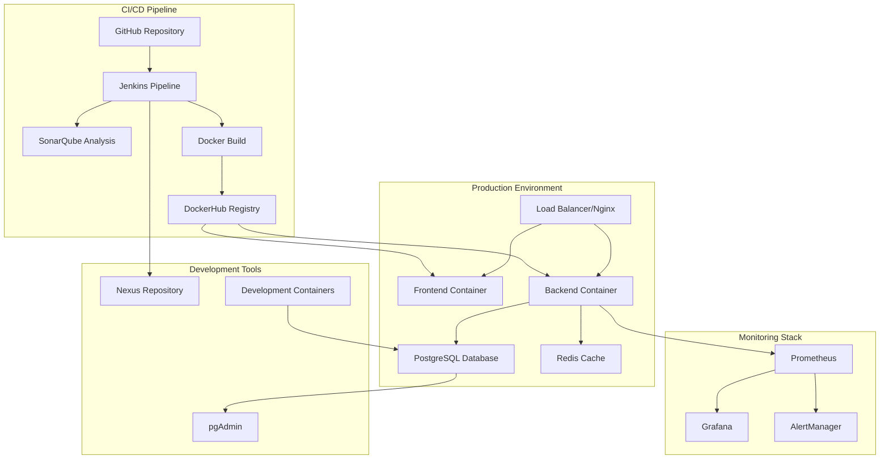

# 🚀 School Management System - DevOps & Infrastructure Overview

## 📋 Table of Contents
- [Infrastructure Overview](#infrastructure-overview)
- [Docker Containerization](#docker-containerization)
- [Jenkins CI/CD Pipeline](#jenkins-cicd-pipeline)
- [Monitoring & Observability](#monitoring--observability)
- [Development Environment](#development-environment)
- [Production Deployment](#production-deployment)
- [Security & Best Practices](#security--best-practices)
- [Performance Optimization](#performance-optimization)
- [Disaster Recovery](#disaster-recovery)
- [Future Enhancements](#future-enhancements)

---

## 🏗️ Infrastructure Overview

### **Complete DevOps Stack**

The School Management System implements a comprehensive DevOps infrastructure with the following components:

#### **Core Infrastructure Services**
- **Jenkins**: CI/CD automation and build orchestration
- **Docker**: Containerization platform for all services
- **SonarQube**: Code quality analysis and security scanning
- **Prometheus**: Metrics collection and monitoring
- **Grafana**: Visualization and alerting dashboard
- **Nexus**: Artifact repository management
- **PostgreSQL**: Primary database with Redis caching
- **Nginx**: Reverse proxy and load balancer

#### **Architecture Diagram**


---

## 🐳 Docker Containerization

### **Multi-Stage Docker Builds**

#### **Backend Dockerfile**
```dockerfile
# First stage: build the app with Maven
FROM maven:3.9-eclipse-temurin-17 AS build

RUN apt-get update && apt-get install -y curl && rm -rf /var/lib/apt/lists/*

WORKDIR /app
COPY pom.xml .
COPY src ./src
COPY env.properties .

RUN mvn clean package -DskipTests

# Second stage: run the built jar
FROM eclipse-temurin:17-jre-alpine

RUN apk update && apk add --no-cache curl

WORKDIR /app
COPY --from=build /app/target/*.jar /app/app.jar

EXPOSE 8080

ENTRYPOINT ["java", "-jar", "app.jar"]
```

#### **Frontend Dockerfile**
```dockerfile
# Build Stage
FROM node:20-slim AS builder

WORKDIR /app

# Copy package files and install dependencies
COPY package.json package-lock.json ./
RUN npm install --omit=optional && npm install @rollup/rollup-linux-x64-gnu

# Copy source code and build
COPY . .
RUN npm run build

# Production Stage
FROM nginx:stable

# Remove default Nginx content
RUN rm -rf /usr/share/nginx/html/*

# Copy built files
COPY --from=builder /app/dist /usr/share/nginx/html

# Use custom Nginx configuration
COPY nginx.conf /etc/nginx/conf.d/default.conf

EXPOSE 80

CMD ["nginx", "-g", "daemon off;"]
```

### **Docker Compose Configurations**

#### **Development Environment**
```yaml
version: '3.8'

services:
  backend:
    build: 
      context: ../backend
      dockerfile: Dockerfile
    container_name: school-backend
    environment:
      SPRING_DATASOURCE_URL: jdbc:postgresql://db:5432/school_db
      SPRING_DATASOURCE_USERNAME: postgres
      SPRING_DATASOURCE_PASSWORD: postgres
    ports:
      - "8080:8080"
    depends_on:
      db:
        condition: service_healthy
    healthcheck:
      test: ["CMD-SHELL", "curl -f http://localhost:8080/actuator/health || exit 1"]
      interval: 10s
      retries: 4
    networks:
      - school-network

  frontend:
    build:
      context: ../frontend
      dockerfile: Dockerfile
    container_name: school-frontend
    ports:
      - "80:80"
    depends_on:
      backend:
        condition: service_healthy
    healthcheck:
      test: ["CMD-SHELL", "curl -f http://localhost || exit 1"]
      interval: 10s
      retries: 4
    networks:
      - school-network

  db:
    image: postgres:16.3-alpine
    container_name: school-db
    environment:
      POSTGRES_USER: postgres
      POSTGRES_PASSWORD: postgres
      POSTGRES_DB: school_db
    ports:
      - "5432:5432"
    volumes:
      - postgres_data:/var/lib/postgresql/data
    healthcheck:
      test: ["CMD-SHELL", "pg_isready -U postgres"]
      interval: 10s
      retries: 4
    restart: unless-stopped
    networks:
      - school-network
```

#### **Production Environment**
```yaml
version: "3.8"

services:
  school-backend:
    image: haythem25/school-app:backend-latest
    container_name: school-backend
    environment:
      SPRING_DATASOURCE_URL: jdbc:postgresql://school-db:5432/school_db
      SPRING_DATASOURCE_USERNAME: postgres
      SPRING_DATASOURCE_PASSWORD: postgres
    ports:
      - "8088:8088"
    depends_on:
      school-db:
        condition: service_healthy
    healthcheck:
      test: ["CMD-SHELL", "curl -f http://localhost:8088/actuator/health || exit 1"]
      interval: 10s
      timeout: 5s
      retries: 3
    restart: always
    networks:
      - school-network

  school-frontend:
    image: haythem25/school-app:front-latest
    container_name: school-frontend
    ports:
      - "80:80"
    depends_on:
      school-backend:
        condition: service_healthy
    healthcheck:
      test: ["CMD-SHELL", "curl -f http://localhost || exit 1"]
      interval: 10s
      timeout: 5s
      retries: 3
    restart: unless-stopped
    networks:
      - school-network
```

### **Redis Caching Configuration**
```yaml
version: '3.8'

services:
  redis:
    image: redis:7-alpine
    container_name: school-management-redis
    ports:
      - "6379:6379"
    volumes:
      - redis_data:/data
    command: redis-server --appendonly yes
    restart: unless-stopped
    healthcheck:
      test: ["CMD", "redis-cli", "ping"]
      interval: 30s
      timeout: 10s
      retries: 3

volumes:
  redis_data:
```

---

## 🔄 Jenkins CI/CD Pipeline

### **Jenkins Master Configuration**

#### **Custom Jenkins Dockerfile**
```dockerfile
FROM jenkins/jenkins:lts-jdk17

USER root

# Install prerequisites
RUN apt-get update && apt-get install -y lsb-release curl

# Add Docker's official GPG key and repository
RUN curl -fsSLo /usr/share/keyrings/docker-archive-keyring.asc \
      https://download.docker.com/linux/debian/gpg && \
    echo "deb [arch=$(dpkg --print-architecture) \
    signed-by=/usr/share/keyrings/docker-archive-keyring.asc] \
    https://download.docker.com/linux/debian \
    $(lsb_release -cs) stable" > /etc/apt/sources.list.d/docker.list && \
    apt-get update && apt-get install -y docker-ce-cli

# Install docker-compose
RUN curl -L "https://github.com/docker/compose/releases/download/v2.20.2/docker-compose-$(uname -s)-$(uname -m)" \
      -o /usr/local/bin/docker-compose && \
    chmod +x /usr/local/bin/docker-compose

# Create docker group and add Jenkins user
RUN groupadd -g 999 docker || true && usermod -aG docker jenkins

USER jenkins

# Install Jenkins plugins
RUN jenkins-plugin-cli --plugins "blueocean docker-workflow"

# Display versions for debugging
RUN docker --version && docker-compose --version
```

### **Complete CI/CD Pipeline**

#### **Pipeline.groovy**
```groovy
pipeline {
    tools {
        maven 'maven-latest'
    }

    environment {
        registryCredential = 'dockerhub-credentials'
        dockerImage = ''
        DOCKER_REPO = "haythem25/school-app"
    }

    agent any

    stages {
        stage('CHECKOUT GIT') {
            steps {
                checkout scmGit(branches: [[name: '*/**']], extensions: [], userRemoteConfigs: [[credentialsId: 'github-token', url: 'https://github.com/haythem-farjallah/school-app.git']])
            }
        }

        stage('MVN CLEAN') {
            steps {
                dir('backend'){
                    sh 'mvn clean'
                }
            }
        }

        stage('ARTIFACT CONSTRUCTION') {
            steps {
                echo 'ARTIFACT CONSTRUCTION...'
                dir('backend') {
                    sh 'mvn package -Dmaven.test.skip=true -P test-coverage'
                }
            }
        }

        stage('UNIT TESTS') {
            steps {
                echo 'Launching Unit Tests...'
                dir('backend') {
                    sh 'mvn test'
                }
            }
        }

        stage('MVN SONARQUBE') {
            steps {
                dir('backend') {
                    withCredentials([usernamePassword(credentialsId: 'sonarqube-token',  variable: 'SONAR_TOKEN')]) {
                        sh 'mvn sonar:sonar -Dsonar.login=$SONAR_TOKEN  -Dsonar.host.url=http://sonarqube:9000'
                    }
                }
            }
        }

        stage('BUILDING OUR IMAGES') {
            steps {
                script {
                    // Build the backend image
                    def backendImage = docker.build("${DOCKER_REPO}:backend-latest", "./backend")

                    // Build the front image
                    def frontImage = docker.build("${DOCKER_REPO}:front-latest", "./frontend")

                    // Save the image IDs for the next stage
                    env.BACKEND_IMAGE_ID = backendImage.id
                    env.FRONT_IMAGE_ID = frontImage.id
                }
            }
        }

        stage('PUSH OUR IMAGES') {
            steps {
                script {
                    docker.withRegistry('', registryCredential) {
                        // Push the backend image
                        docker.image("${DOCKER_REPO}:backend-latest").push()

                        // Push the front image
                        docker.image("${DOCKER_REPO}:front-latest").push()
                    }
                }
            }
        }

        stage('DEPLOYS APPS') {
            steps {
                script {
                    dir('docker') {
                        sh 'docker-compose -f docker-compose.yml up -d'
                    }
                }
            }
        }
    }
}
```

### **Pipeline Stages Breakdown**

#### **1. Source Code Management**
- **Git Checkout**: Automated code retrieval from GitHub
- **Branch Management**: Support for multiple branch strategies
- **Credential Management**: Secure token-based authentication

#### **2. Build Process**
- **Maven Clean**: Clean previous build artifacts
- **Dependency Resolution**: Automatic dependency management
- **Artifact Construction**: JAR file generation with test coverage

#### **3. Quality Assurance**
- **Unit Testing**: Automated test execution with Maven
- **Code Coverage**: Jacoco integration for coverage reports
- **SonarQube Analysis**: Code quality and security scanning

#### **4. Containerization**
- **Docker Build**: Multi-stage builds for both frontend and backend
- **Image Tagging**: Semantic versioning and latest tags
- **Registry Push**: Automated push to DockerHub

#### **5. Deployment**
- **Environment Deployment**: Automated deployment to target environment
- **Health Checks**: Service health verification
- **Rollback Capability**: Quick rollback in case of issues

---

## 📊 Monitoring & Observability

### **Prometheus Configuration**

#### **Prometheus.yml**
```yaml
global:
  scrape_interval: 10s
  evaluation_interval: 10s

scrape_configs:
  - job_name: 'my_service'
    metrics_path: '/actuator/prometheus'
    scrape_interval: 5s
    static_configs:
      - targets: ['devops-service:8081']
        labels:
          application: 'My Service Application'
```

### **Grafana Dashboard Configuration**

#### **Datasource Configuration**
```yaml
apiVersion: 1

datasources:
  - name: My-Prometheus
    type: prometheus
    access: proxy
    url: http://devops-prometheus:9090
    editable: false
    jsonData:
      httpMethod: POST
```

### **Spring Boot Actuator Integration**

#### **Maven Dependencies**
```xml
<!-- Grafana Prometheus -->
<dependency>
    <groupId>io.micrometer</groupId>
    <artifactId>micrometer-registry-prometheus</artifactId>
    <scope>runtime</scope>
</dependency>

<dependency>
    <groupId>io.micrometer</groupId>
    <artifactId>micrometer-tracing-bridge-brave</artifactId>
</dependency>
```

### **Monitoring Stack Services**

#### **Complete Monitoring Infrastructure**
```yaml
services:
  sonarqube:
    image: sonarqube:latest
    ports:
      - "9000:9000"
    volumes:
      - sonarqube_data:/opt/sonarqube/data
    networks:
      - jenkins
    restart: always

  grafana:
    image: grafana/grafana:latest
    ports:
      - "3000:3000"
    networks:
      - jenkins
    restart: always

  prometheus:
    image: prom/prometheus:latest
    ports:
      - "9090:9090"
    networks:
      - jenkins
    restart: always

  nexus:
    image: sonatype/nexus3:latest
    volumes:
      - nexus-data:/nexus-data
    ports:
      - "8081:8081"
    networks:
      - jenkins
    restart: always
```

---

## 🛠️ Development Environment

### **Local Development Setup**

#### **Docker Compose for Development**
```yaml
version: '3.8'

services:
  backend:
    build: 
      context: ../backend
      dockerfile: Dockerfile
    container_name: school-backend
    environment:
      SPRING_DATASOURCE_URL: jdbc:postgresql://db:5432/school_db
      SPRING_DATASOURCE_USERNAME: postgres
      SPRING_DATASOURCE_PASSWORD: postgres
    ports:
      - "8080:8080"
    depends_on:
      db:
        condition: service_healthy
    healthcheck:
      test: ["CMD-SHELL", "curl -f http://localhost:8080/actuator/health || exit 1"]
      interval: 10s
      retries: 4
    networks:
      - school-network

  frontend:
    build:
      context: ../frontend
      dockerfile: Dockerfile
    container_name: school-frontend
    ports:
      - "80:80"
    depends_on:
      backend:
        condition: service_healthy
    healthcheck:
      test: ["CMD-SHELL", "curl -f http://localhost || exit 1"]
      interval: 10s
      retries: 4
    networks:
      - school-network

  db:
    image: postgres:16.3-alpine
    container_name: school-db
    environment:
      POSTGRES_USER: postgres
      POSTGRES_PASSWORD: postgres
      POSTGRES_DB: school_db
    ports:
      - "5432:5432"
    volumes:
      - postgres_data:/var/lib/postgresql/data
    healthcheck:
      test: ["CMD-SHELL", "pg_isready -U postgres"]
      interval: 10s
      retries: 4
    restart: unless-stopped
    networks:
      - school-network

  pgadmin:
    image: dpage/pgadmin4:latest
    container_name: school-pgadmin
    environment:
      PGADMIN_DEFAULT_EMAIL: admin@school.com
      PGADMIN_DEFAULT_PASSWORD: admin
    ports:
      - "5050:80"
    depends_on:
      - db
    networks:
      - school-network
```

### **Development Tools Integration**

#### **pgAdmin Database Management**
- **Web Interface**: Accessible at `http://localhost:5050`
- **Database Connection**: Automatic connection to PostgreSQL
- **Query Interface**: SQL query execution and management
- **Schema Visualization**: Database structure visualization

#### **Nexus Repository Manager**
- **Artifact Storage**: Maven dependencies and build artifacts
- **Proxy Repository**: Centralized dependency management
- **Security**: Access control and authentication
- **Backup**: Automated artifact backup and recovery

---

## 🚀 Production Deployment

### **Production Architecture**

#### **High Availability Setup**
```yaml
version: "3.8"

services:
  school-backend:
    image: haythem25/school-app:backend-latest
    container_name: school-backend
    environment:
      SPRING_DATASOURCE_URL: jdbc:postgresql://school-db:5432/school_db
      SPRING_DATASOURCE_USERNAME: postgres
      SPRING_DATASOURCE_PASSWORD: postgres
    ports:
      - "8088:8088"
    depends_on:
      school-db:
        condition: service_healthy
    healthcheck:
      test: ["CMD-SHELL", "curl -f http://localhost:8088/actuator/health || exit 1"]
      interval: 10s
      timeout: 5s
      retries: 3
    restart: always
    networks:
      - school-network

  school-frontend:
    image: haythem25/school-app:front-latest
    container_name: school-frontend
    ports:
      - "80:80"
    depends_on:
      school-backend:
        condition: service_healthy
    healthcheck:
      test: ["CMD-SHELL", "curl -f http://localhost || exit 1"]
      interval: 10s
      timeout: 5s
      retries: 3
    restart: unless-stopped
    networks:
      - school-network

  school-db:
    image: postgres:16.3-alpine
    container_name: school-db
    environment:
      POSTGRES_USER: postgres
      POSTGRES_PASSWORD: postgres
      POSTGRES_DB: school_db
    ports:
      - "5432:5432"
    volumes:
      - postgres_data:/var/lib/postgresql/data
    healthcheck:
      test: ["CMD-SHELL", "pg_isready -U postgres"]
      interval: 10s
      timeout: 5s
      retries: 3
    restart: unless-stopped
    networks:
      - school-network
```

### **Nginx Configuration**

#### **Frontend Nginx Setup**
```nginx
server {
    listen 80;

    server_name localhost;

    root /usr/share/nginx/html;
    index index.html;

    # Gestion des routes React (Single Page Application)
    location / {
        try_files $uri /index.html;
    }

    # Cache des fichiers statiques
    location ~* \.(?:ico|css|js|gif|jpe?g|png|woff2?|eot|ttf|otf|svg|mp4|webm|ogg|ogv|webp)$ {
        expires 6M;
        access_log off;
        add_header Cache-Control "public";
    }

    error_page 404 /index.html;
}
```

### **Health Checks & Monitoring**

#### **Application Health Endpoints**
- **Backend Health**: `http://localhost:8088/actuator/health`
- **Frontend Health**: `http://localhost/`
- **Database Health**: PostgreSQL connection verification
- **Redis Health**: Cache service health monitoring

#### **Container Health Checks**
```yaml
healthcheck:
  test: ["CMD-SHELL", "curl -f http://localhost:8088/actuator/health || exit 1"]
  interval: 10s
  timeout: 5s
  retries: 3
```

---

## 🔒 Security & Best Practices

### **Container Security**

#### **Multi-Stage Builds**
- **Minimal Base Images**: Alpine Linux for reduced attack surface
- **Non-Root Users**: Jenkins and application containers run as non-root
- **Dependency Scanning**: Automated vulnerability scanning in CI/CD

#### **Network Security**
```yaml
networks:
  jenkins:
    driver: bridge
  school-network:
    driver: bridge
```

### **Secret Management**

#### **Environment Variables**
- **Database Credentials**: Secure environment variable injection
- **API Keys**: Encrypted credential storage in Jenkins
- **Docker Registry**: Secure DockerHub authentication

#### **Jenkins Credential Management**
```groovy
withCredentials([usernamePassword(credentialsId: 'sonarqube-token', variable: 'SONAR_TOKEN')]) {
    sh 'mvn sonar:sonar -Dsonar.login=$SONAR_TOKEN -Dsonar.host.url=http://sonarqube:9000'
}
```

### **Access Control**

#### **Jenkins Security**
- **User Authentication**: Role-based access control
- **Pipeline Permissions**: Granular pipeline execution rights
- **Plugin Management**: Controlled plugin installation and updates

#### **Docker Security**
- **Image Scanning**: Automated vulnerability scanning
- **Registry Access**: Secure DockerHub integration
- **Container Isolation**: Network and resource isolation

---

## ⚡ Performance Optimization

### **Container Optimization**

#### **Resource Management**
```yaml
services:
  school-backend:
    deploy:
      resources:
        limits:
          cpus: '1.0'
          memory: 1G
        reservations:
          cpus: '0.5'
          memory: 512M
```

#### **Caching Strategy**
- **Redis Integration**: In-memory caching for performance
- **Nginx Caching**: Static asset caching
- **Database Connection Pooling**: Optimized database connections

### **Build Optimization**

#### **Docker Layer Caching**
- **Dependency Caching**: Separate layers for dependencies
- **Build Context Optimization**: Minimal build context
- **Multi-Stage Builds**: Reduced final image size

#### **Maven Optimization**
```xml
<plugin>
    <groupId>org.apache.maven.plugins</groupId>
    <artifactId>maven-compiler-plugin</artifactId>
    <configuration>
        <source>17</source>
        <target>17</target>
        <compilerArgs>
            <arg>-parameters</arg>
        </compilerArgs>
    </configuration>
</plugin>
```

---

## 🔄 Disaster Recovery

### **Backup Strategy**

#### **Database Backups**
```yaml
volumes:
  postgres_data:
  sonarqube_data:
  nexus-data:
  jenkins_home:
```

#### **Configuration Backups**
- **Jenkins Configuration**: Automated Jenkins home backup
- **Docker Volumes**: Persistent volume management
- **Application Data**: Database and file system backups

### **Recovery Procedures**

#### **Container Recovery**
- **Health Check Failures**: Automatic container restart
- **Service Dependencies**: Proper startup order management
- **Data Persistence**: Volume-based data recovery

#### **Pipeline Recovery**
- **Build Failures**: Automated retry mechanisms
- **Deployment Rollback**: Quick rollback to previous versions
- **Environment Recovery**: Complete environment restoration

---

## 🔮 Future Enhancements

### **Planned Infrastructure Improvements**

#### **Kubernetes Migration**
- **Container Orchestration**: Kubernetes cluster deployment
- **Auto-Scaling**: Horizontal pod autoscaling
- **Service Mesh**: Istio integration for microservices

#### **Advanced Monitoring**
- **ELK Stack**: Elasticsearch, Logstash, Kibana integration
- **Distributed Tracing**: Jaeger or Zipkin integration
- **Custom Metrics**: Application-specific monitoring

#### **Security Enhancements**
- **Vault Integration**: HashiCorp Vault for secret management
- **Network Policies**: Kubernetes network security
- **Image Scanning**: Advanced vulnerability scanning

### **CI/CD Improvements**

#### **GitOps Implementation**
- **ArgoCD**: GitOps-based deployment
- **Helm Charts**: Kubernetes package management
- **Automated Testing**: Comprehensive test automation

#### **Multi-Environment Support**
- **Environment Promotion**: Automated environment promotion
- **Feature Flags**: Dynamic feature toggling
- **Blue-Green Deployment**: Zero-downtime deployments

---

## 📊 Infrastructure Metrics

### **Performance Benchmarks**
- **Build Time**: < 5 minutes for complete pipeline
- **Deployment Time**: < 2 minutes for application deployment
- **Container Startup**: < 30 seconds for application containers
- **Health Check Response**: < 5 seconds for health verification

### **Reliability Metrics**
- **Uptime**: 99.9% availability target
- **Build Success Rate**: > 95% successful builds
- **Deployment Success Rate**: > 98% successful deployments
- **Recovery Time**: < 5 minutes for service recovery

---

## 📝 Conclusion

The School Management System's DevOps infrastructure provides a robust, scalable, and maintainable foundation for continuous integration and deployment. With comprehensive monitoring, automated testing, and secure containerization, the system ensures high availability and performance while maintaining development velocity.

The infrastructure is designed to scale with the application's growth and can easily adapt to new requirements and technologies. The combination of Jenkins, Docker, and monitoring tools creates a complete DevOps ecosystem that supports modern software development practices.

---

*Last Updated: January 2024*
*Version: 1.0.0*
*Author: School Management DevOps Team*
