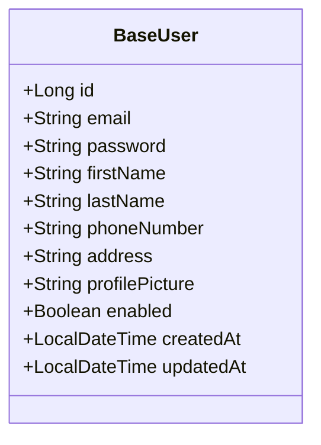
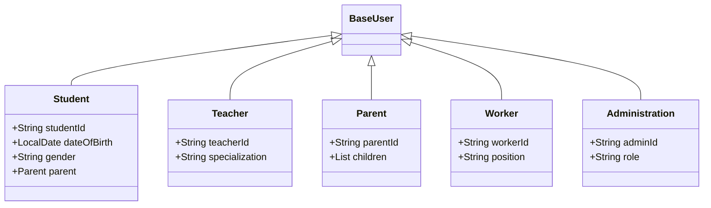
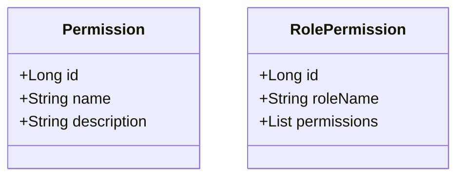
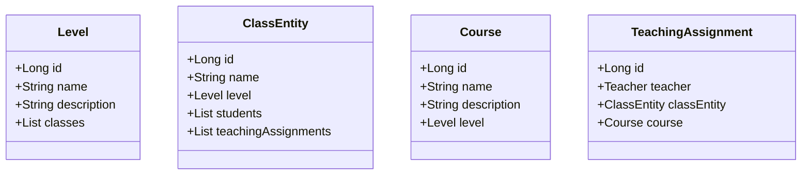
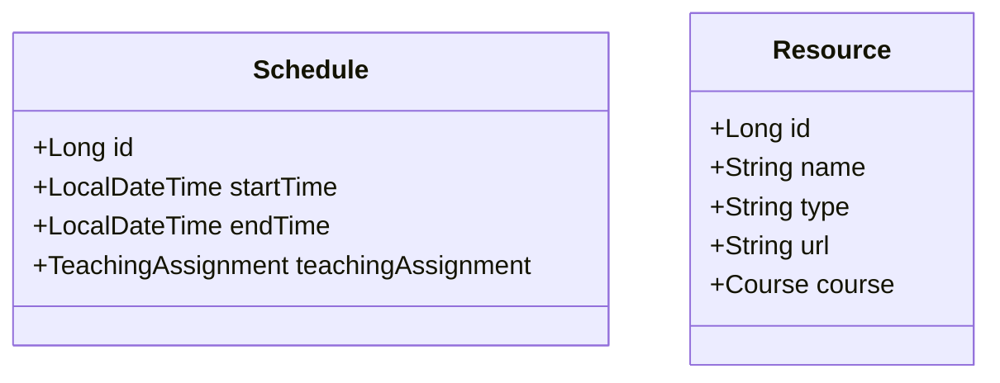
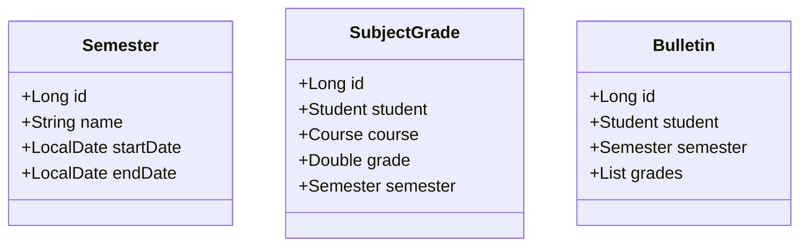
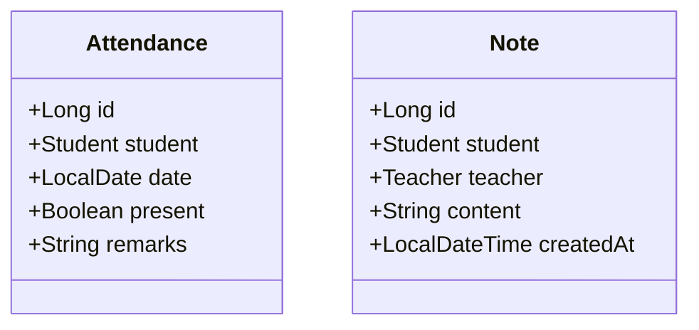
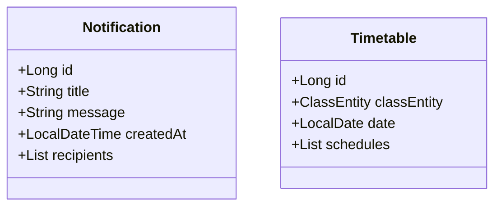
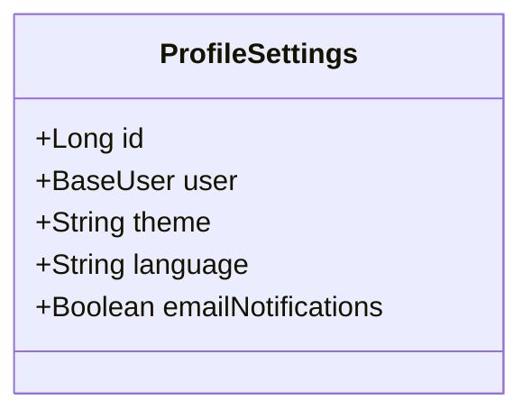

# School Management System - Entity Class Diagram

This document provides a comprehensive overview of the entity relationships in the School Management System.

## Authentication and User Management

### Base User Entity

### User Types

### Role and Permission Management

## Academic Management

### Academic Structure

### Schedule and Resources

## Operational Management

### Academic Operations

### Attendance and Notes

### Communication

### User Settings

## Relationships Overview

1. **User Hierarchy**:
   - All user types (Student, Teacher, Parent, Worker, Administration) inherit from BaseUser
   - Parent has a one-to-many relationship with Student
   - Teacher has many-to-many relationship with ClassEntity through TeachingAssignment

2. **Academic Structure**:
   - Level contains multiple ClassEntity
   - ClassEntity contains multiple Students
   - Course is associated with Level
   - TeachingAssignment connects Teacher, ClassEntity, and Course

3. **Operational Structure**:
   - Semester organizes academic periods
   - SubjectGrade connects Student, Course, and Semester
   - Bulletin aggregates SubjectGrades for a Student in a Semester
   - Attendance tracks Student presence
   - Note allows Teacher to Student communication
   - Notification can be sent to multiple users
   - Timetable organizes Schedules for a ClassEntity

4. **Settings and Permissions**:
   - ProfileSettings is associated with BaseUser
   - RolePermission manages user access through Permissions 